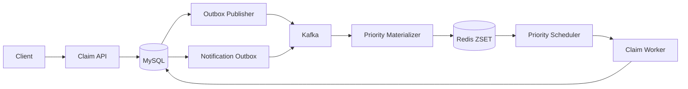

# Voucher Claim System

A production-oriented Spring Boot reference implementation for high-contention voucher campaigns. The system accepts durable claim requests, prioritizes users by score, and allocates a finite inventory without overselling.

## What This Project Demonstrates

- A controller → facade → service → repository architecture.
- MySQL as the source of truth for campaigns, claim requests, inventory slots, claims, and outbox events.
- Redis Sorted Sets for fast, best-effort score-based scheduling.
- Kafka for durable asynchronous transport between admission, scheduling, and notification stages.
- The transactional outbox pattern for reliable event publication.
- Database-backed recovery for Redis loss, consumer restarts, and expired worker leases.
- Idempotent create, activate, and claim operations.
- UUIDv7 campaign identifiers.

## Technology

- Java 17
- Spring Boot 3
- Spring Data JPA / Hibernate
- MySQL 8
- Redis
- Apache Kafka
- Maven

## Project Structure

    src/main/java/.../
    ├── controller/          HTTP endpoints and request logging
    ├── facade/              Use-case orchestration
    ├── service/             Service contracts
    ├── service/impl/        Business implementations
    ├── repository/          JPA repositories and native slot queries
    ├── model/               JPA entities
    ├── type/                Enums and state definitions
    ├── messaging/           Kafka producers and consumers
    ├── scheduler/           Priority dispatch, outbox, and recovery jobs
    └── configuration/       Redis, Kafka, and application configuration

## Claim Lifecycle

The API first persists a claim request and an outbox event in one MySQL transaction. Kafka delivery then materializes that request into a campaign-specific Redis Sorted Set. The scheduler waits for a short internal collection window, pops the highest scores, and submits no more work than the worker pool can execute.

Priority is intentionally best-effort. Requests already present in the same Redis queue are dequeued by descending score, but parallel workers and transaction timing do not guarantee that database commits occur in exactly that order.

## High-Contention Inventory

The implementation does not decrement one shared campaign counter for every claim. Activation creates one independent row per voucher:

    voucher_claim_slot(campaign_id, slot_no)

Each claim transaction selects one available row using:

    SELECT ...
    FOR UPDATE SKIP LOCKED
    LIMIT 1

The transaction deletes the selected slot, inserts the claim, and writes the success outbox event atomically. Concurrent workers therefore spread across different rows instead of contending on one hot counter. MySQL constraints prevent duplicate claims and duplicate voucher codes.

No distributed lock is required for the claim path. Database row locks and unique constraints are the correctness boundary; Redis remains an acceleration and scheduling layer.

## Identifiers

- Campaign IDs are RFC 9562 UUIDv7 strings, which are time ordered and database-index friendly.
- User IDs and merchant IDs are opaque strings.
- API validation requires identifiers to be present, but does not enforce their length or format.
- Voucher codes are globally unique in the current schema.

## Run Locally

Prerequisites: JDK 17, Maven, and Docker.

Start infrastructure:

    docker compose up -d

Run the application:

    mvn spring-boot:run

The default local configuration expects MySQL, Redis, and Kafka from [compose.yaml](compose.yaml).

## Example Workflow

Create a campaign:

    curl -i -X POST http://localhost:8080/v1/campaigns \
      -H "Content-Type: application/json" \
      -H "X-Merchant-Id: 1234567890123456" \
      -H "Idempotency-Key: create-campaign-001" \
      -d "{\"name\":\"Launch campaign\",\"totalQuantity\":1000,\"startsAt\":\"2026-08-28T12:00:00Z\",\"endsAt\":\"2026-08-29T12:00:00Z\"}"

Activate it:

    curl -i -X POST http://localhost:8080/v1/campaigns/activate \
      -H "Content-Type: application/json" \
      -H "X-Merchant-Id: 1234567890123456" \
      -H "Idempotency-Key: activate-campaign-001" \
      -d "{\"campaignId\":\"<campaignId>\"}"

Store a trusted score snapshot:

    curl -i -X PUT http://localhost:8080/internal/v1/user-scores/1234567890123456 \
      -H "Content-Type: application/json" \
      -H "X-Internal-Token: local-internal-token" \
      -d "{\"score\":800}"

Submit a claim:

    curl -i -X POST http://localhost:8080/api/v1/claims \
      -H "Content-Type: application/json" \
      -H "Idempotency-Key: claim-001" \
      -d "{\"userId\":\"1234567890123456\",\"campaignId\":\"<campaignId>\"}"

Ready-to-run request files are available in the [http](http) directory.

## Verification

Run the automated tests:

    mvn test

The suite covers identifier generation, idempotency, campaign transitions, priority queue behavior, claim correctness, recovery, and transactional outbox flows.

## Correctness Invariants

- A campaign never allocates more claims than its materialized slots.
- A user can claim at most once per campaign.
- An idempotency key represents at most one accepted claim request.
- A voucher code can appear in at most one claim.
- An accepted request is recoverable from MySQL even if Redis is flushed.
- Kafka publication is at-least-once; consumers and database writes are idempotent.

## Documentation

- [SOLUTION.md](SOLUTION.md) describes the architecture, data model, concurrency strategy, and failure handling.
- [API-specs.md](API-specs.md) defines the HTTP contract, examples, status codes, and retry behavior.
