# Voucher Claim System — Solution

HTTP contract: [API-specs.md](API-specs.md).

## 1. Scope

### Functional requirements

- A merchant creates a voucher campaign.
- A merchant activates a campaign.
- A user can claim at most one voucher in a campaign.
- Requests with higher scores are processed first within the same priority window.
- A retry with the same `Idempotency-Key` returns the previously created claim.
- The system supports a burst of 5,000 requests per second for one campaign.
- A successful claim creates a `VoucherClaimed` outbox event. The publisher sends it to Kafka for asynchronous consumption by the Notification Service.

### Non-functional requirements

- No overselling.
- No duplicate claim for the same `(campaign_id, user_id)`.
- MySQL is the source of truth.
- Redis never decides final correctness.
- No Virtual Waiting Room.
- No distributed lock around the claim transaction.
- Claim transactions remain short and do not lock one shared campaign inventory counter.

### Out of scope

- Voucher redemption.
- Payment.
- Campaign search and catalog.
- JWT implementation.
- The external Notification Service implementation. The starter keeps a consumer and logging client in the same deployable application for local execution.
- Cross-region active-active writes.

## 2. Traffic Model

| Item | Value |
|---|---:|
| Peak ingress | 5,000 claim requests/s/campaign |
| Internal priority collection window | 10–1,000 ms; default 100 ms |
| Maximum pending Redis queue | 10,000 requests/campaign |
| HTTP result wait | 1,500 ms |
| Idempotency result TTL | 30 seconds |
| Maximum inventory in the current implementation | 100,000 vouchers/campaign |

The burst is first persisted in `claim_request` and then materialized into Redis. MySQL claim-write concurrency is bounded by the claim-worker executor. Requests without immediate worker capacity retain durable state and can be reconstructed by the Recovery Watcher.

## 3. API Contract

JSON properties and query parameters use `camelCase`. Database columns use `snake_case` and do not affect the HTTP contract.

`priorityWindowMs` is not part of the public API. The priority collection window is an internal operational setting from `app.priority.collection-window`. Its value is persisted with the campaign so all schedulers apply it consistently.

### 3.1 Create campaign

```http
POST /v1/campaigns
X-Merchant-Id: <merchant_id>
Idempotency-Key: <key>
Content-Type: application/json
```

```json
{
  "name": "Summer campaign",
  "discountType": "PERCENTAGE",
  "discountValue": 15,
  "totalQuantity": 10000,
  "priorityOrder": "SCORE_DESC_THEN_REQUEST_MEMBER_DESC",
  "startAt": "2026-08-01T00:00:00Z",
  "endAt": "2026-09-01T00:00:00Z",
  "voucherExpiresAt": "2026-10-01T00:00:00Z"
}
```

Responses:

- `201 Created`: a new campaign.
- `200 OK` with `Idempotent-Replayed: true`: replay of the same creation key.
- `409 Conflict`: invalid campaign window.

### 3.2 Activate campaign

```http
POST /v1/campaigns/activate
X-Merchant-Id: <merchant_id>
Content-Type: application/json
```

```json
{
  "campaignId": "<campaign_uuid_v7>"
}
```

Responses:

- `200 OK`: campaign activated.
- `200 OK` with `Idempotent-Replayed: true`: campaign was already active.
- `404 Not Found`: the merchant does not own the campaign.
- `409 Conflict`: the current state does not allow activation.

### 3.3 Claim voucher

```http
POST /api/v1/claims
Idempotency-Key: <key>
Content-Type: application/json
```

```json
{
  "userId": "<user_id>",
  "campaignId": "<campaign_uuid_v7>"
}
```

| HTTP | Code | Meaning |
|---:|---|---|
| 201 | — | New claim succeeded |
| 200 | — | Successful claim replay |
| 409 | `ALREADY_CLAIMED` | User claimed with another key |
| 409 | `SOLD_OUT` | No slot remains |
| 410 | `CAMPAIGN_NOT_ACTIVE` | Campaign is inactive or outside its claim window |
| 503 | `CLAIM_BUSY` | Queue, database, or result timeout; retry with the same key |

### 3.4 Read claim

```http
GET /v1/claims/me?campaignId=<campaign_uuid_v7>
X-User-Id: <user_id>
```

## 4. High-Level Architecture

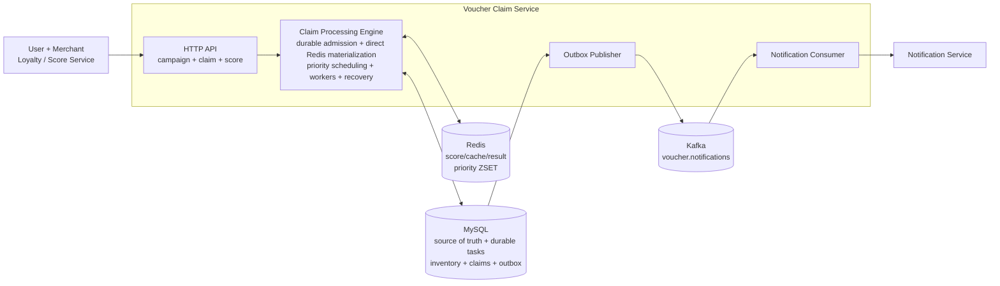

The architecture has two complementary processing paths:

1. **Fast path:** the API commits durable admission to MySQL, directly inserts the request into Redis by score, and lets the scheduler dispatch a worker.
2. **Recovery path:** the watcher reads durable MySQL state and rebuilds Redis when direct materialization fails, a Redis member is lost, or a worker lease expires.

A claim succeeds only after the MySQL transaction commits. Redis is a derived priority index, and Kafka transports post-claim notifications. Neither is a source of truth for pending work or inventory.

### Component ownership

| Component | Responsibility |
|---|---|
| HTTP API | Create and activate campaigns, validate claims, replay cached results, and wait for a bounded result |
| Durable Claim Admission | Create a deterministic `requestId` and commit one `claim_request` before touching Redis |
| Direct Queue Materialization | Load the committed request, execute `ZADD NX` by score, and mark it `QUEUED` |
| Outbox Publisher | Publish committed `VoucherClaimed` events to Kafka and mark `PUBLISHED` only after broker acknowledgement |
| Priority Scheduler + Claim Workers | Run `ZPOPMAX`, bound concurrency, acquire a lease, consume a slot, and persist the claim |
| Recovery Watcher | Rematerialize due/queued requests and reclaim expired `PROCESSING` leases |
| MySQL | Source of truth for campaign, task, lease, inventory, claim, and outbox |
| Redis | Performance layer for score, cache, result, and derived priority ordering |
| Kafka | At-least-once notification transport for `VoucherClaimed` |
| Notification Service | Consume notifications and deduplicate the business effect by `eventId` |

## 5. Data Model

### Identifier format

`campaignId` is an RFC 9562 UUIDv7 containing a 48-bit Unix millisecond timestamp and 74 random bits. Every application instance generates IDs independently, without a database sequence or distributed lock.

Controllers receive identifiers as strings and only validate required/non-blank values. They do not enforce identifier length or a regular expression.

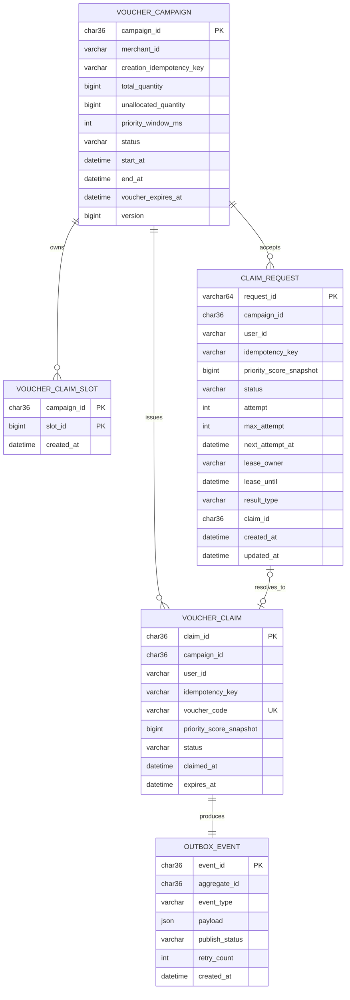

### Required constraints

```sql
UNIQUE (merchant_id, creation_idempotency_key)
UNIQUE (campaign_id, user_id)
UNIQUE (voucher_code)
UNIQUE (campaign_id, user_id, idempotency_key) -- claim_request
PRIMARY KEY (campaign_id, slot_id)
```

### Required indexes

```sql
INDEX idx_claim_idempotency_lookup
    (campaign_id, user_id, idempotency_key)

INDEX idx_campaign_status_time
    (status, start_at, end_at)

INDEX idx_outbox_unpublished
    (publish_status, created_at, event_id)

INDEX idx_claim_request_recovery
    (status, next_attempt_at, lease_until, created_at)
```

### State machines

Campaign lifecycle:

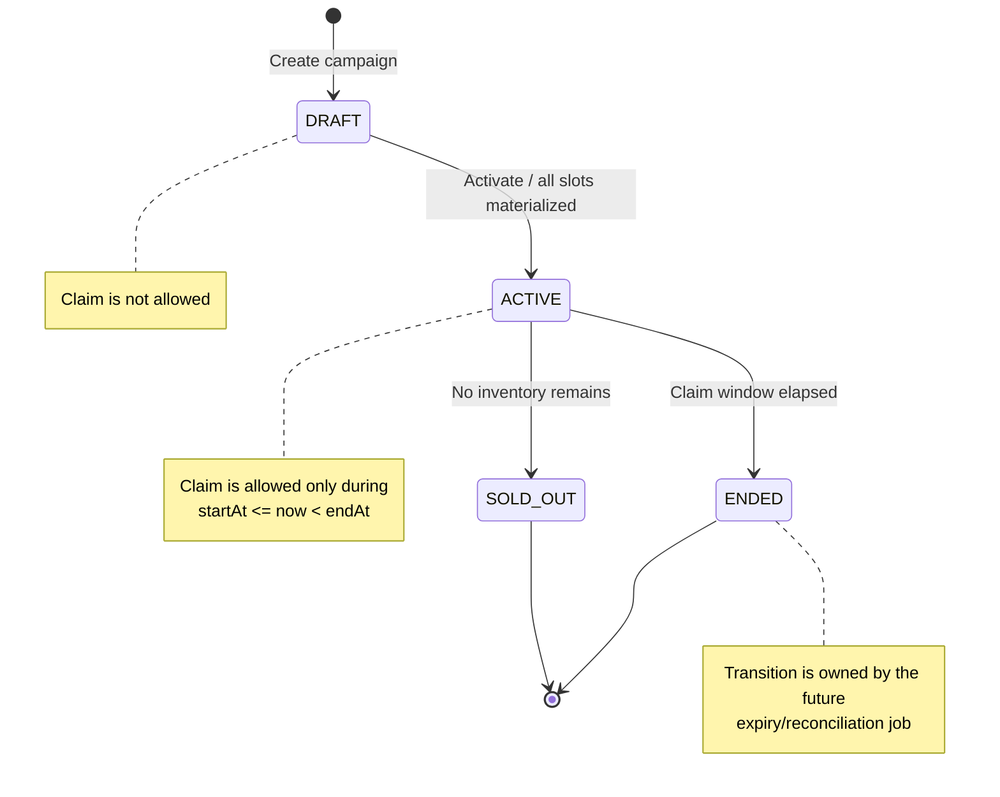

Rules:

- `DRAFT -> ACTIVE` commits only after every claim slot is created.
- `ACTIVE -> SOLD_OUT` occurs only after confirming that no physical slot and no unallocated inventory remain.
- `SOLD_OUT` and `ENDED` are terminal.
- The code implements `DRAFT -> ACTIVE` and `ACTIVE -> SOLD_OUT`. The `ACTIVE -> ENDED` expiry job is outside the implementation scope.

Claim lifecycle in the current claim-only scope:

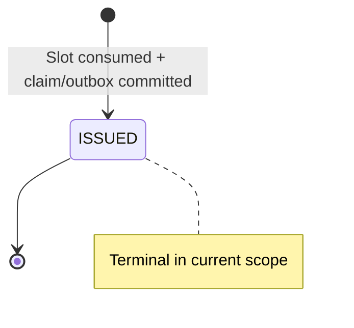

A claim exists only after the MySQL transaction commits. A rollback returns the state to `[not created]`, preserves the slot, and creates no outbox event. `REDEEMED`, `EXPIRED`, and `CANCELLED` belong to a future redemption flow.

Durable claim-request lifecycle:

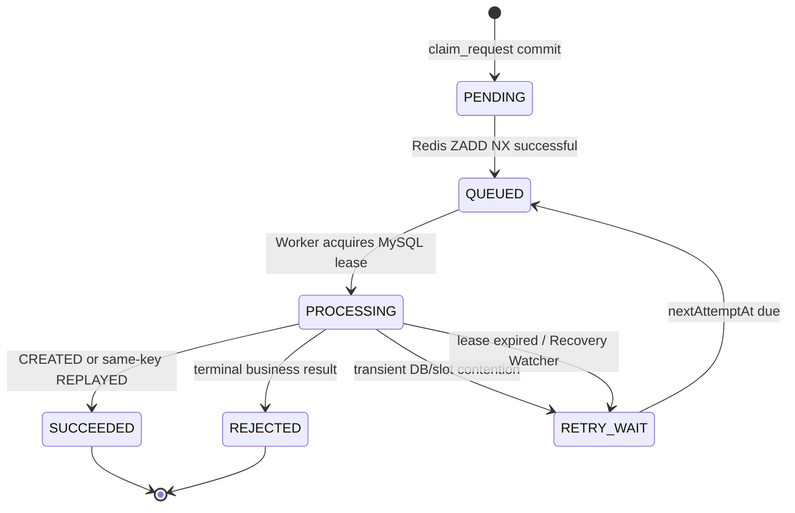

`PENDING`, `QUEUED`, and `RETRY_WAIT` are recoverable. `QUEUED` does not make Redis durable: after `queueRecheckDelay` the watcher may run `ZADD NX` again and move `nextAttemptAt` forward for fair batch scans. `PROCESSING` has one valid owner until `leaseUntil`. Completion and retry must match `leaseOwner`, preventing an old worker from overwriting a new worker.

Outbox lifecycle:

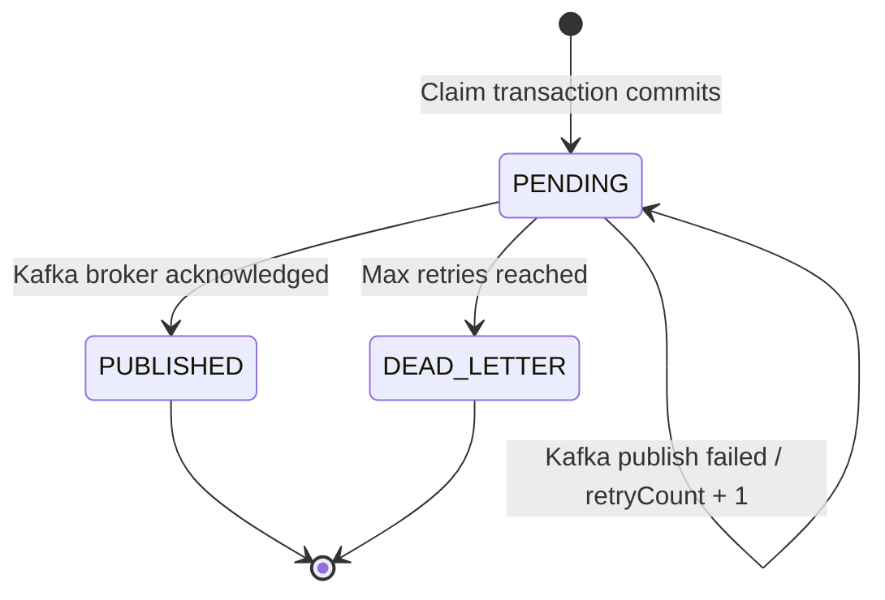

## 6. Redis Model

| Purpose | Key | Type | TTL |
|---|---|---|---:|
| Successful idempotency replay | `claim:idem:{campaignId}:{requestId}` | JSON String | 30s |
| Worker result | `claim:request-result:{campaignId}:{requestId}` | JSON String | 30s |
| Score snapshot | `claim:score:{campaignId}:{userId}` | Integer String | 24h |
| Priority queue | `claim:priority:{campaignId}` | Sorted Set | 10m grace |
| Campaigns with pending work | `claim:priority:active-campaigns` | Set | none |

### Priority queue member

```text
member = userId + ":" + base64url(idempotencyKey)
score  = priorityScoreSnapshot
```

### Enqueue operation

One Lua script atomically executes:

1. `ZSCORE` to detect the same pending logical request.
2. `ZCARD` to enforce the per-campaign queue limit.
3. `ZADD NX` to insert once.
4. `PEXPIRE` to refresh the queue grace TTL.

| Value | Result |
|---:|---|
| `1` | Added |
| `0` | Already pending |
| `-1` | Queue full |

## 7. Campaign Flows

### 7.1 Create

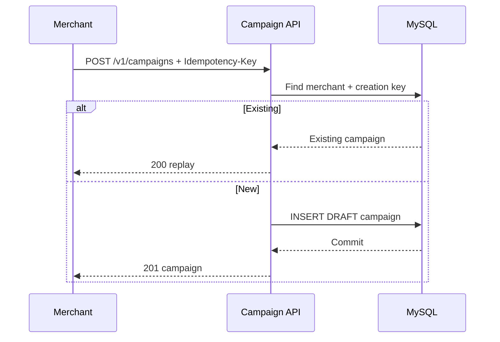

Concurrency authority: `UNIQUE (merchant_id, creation_idempotency_key)`.

### 7.2 Activate

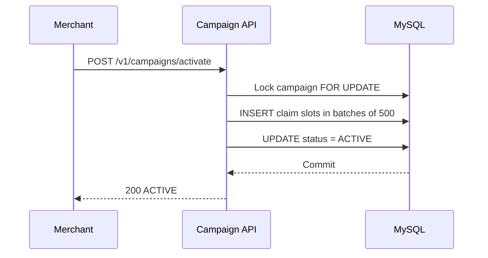

Activation invariant: the campaign becomes `ACTIVE` only after all slots have been materialized.

## 8. Claim Flow

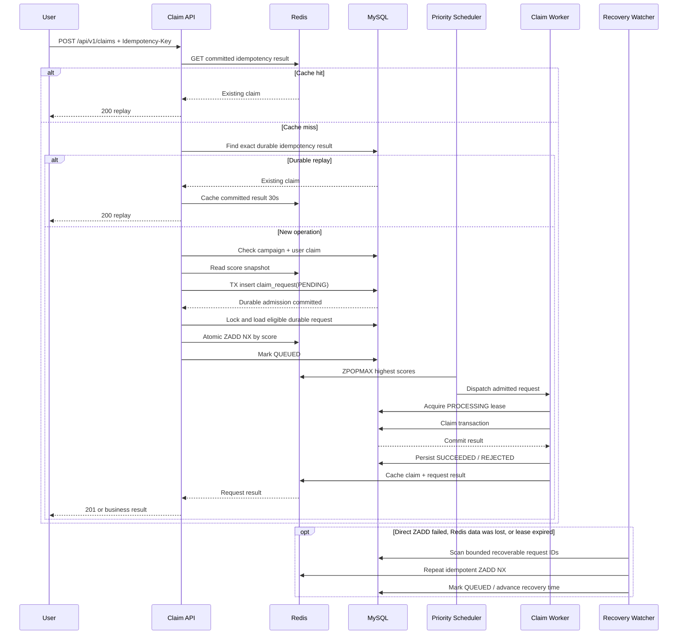

### Idempotency rules

- Scope: `(campaign_id, user_id, idempotency_key)`.
- No request hash.
- Cache hit: replay success.
- Cache miss: continue to MySQL; do not create a negative or pending Redis idempotency key.
- Write the cache only after the MySQL transaction commits.
- TTL expiration does not affect correctness because MySQL retains the durable claim.
- The same pending key produces the same deterministic `requestId`. The `claim_request` primary key permits one durable operation.
- HTTP retries and recovery may enqueue again, but `ZADD NX` and the worker lease make this idempotent.

## 9. Priority Scheduling

### Ordering

```text
Primary:   priority_score_snapshot DESC
Tie-break: Redis member DESC
Scope:     one campaign + one priority window
```

### Scheduler policy

1. The API materializes each committed request directly into the ZSET; the Recovery Watcher repairs gaps from MySQL.
2. Scan `claim:priority:active-campaigns` every 10 ms.
3. Wait for `priority_window_ms` before the first dispatch.
4. Calculate free workers.
5. Set `batchSize = min(admissionBatchSize, availableWorkers)`.
6. Execute `ZPOPMAX batchSize`.
7. Submit workers; each worker must acquire a MySQL lease.
8. Re-enqueue if the executor rejects submission.

Higher scores run first among requests visible when the scheduler selects a batch. This is not strict global ordering across different arrival times. Parallel workers may also commit in a different order from dequeue order.

## 10. Claim Transaction

Isolation level: `READ_COMMITTED`.

The implementation uses a centrally configured `TransactionTemplate`, not `@Transactional`. `ClaimTransactionServiceImpl.execute()` opens the explicit boundary before invoking internal logic. Slot deletion, claim insertion, and outbox insertion therefore remain in one programmatic transaction.

```text
BEGIN
  1. SELECT claim WHERE campaign_id=? AND user_id=?
  2. Validate campaign status and time window
  3. SELECT one slot
       ORDER BY slot_id
       LIMIT 1
       FOR UPDATE SKIP LOCKED
  4. If no unlocked slot:
       - physical slot exists  -> BUSY
       - no physical slot      -> SOLD_OUT
  5. DELETE locked slot
  6. INSERT voucher_claim
  7. INSERT outbox_event
COMMIT
```

### Transactional boundary

The following commit or roll back together:

- Delete one claim slot.
- Insert one voucher claim.
- Insert one outbox event.

### Database race resolution

If two workers for one user reach MySQL:

1. Both can pass the initial read.
2. `UNIQUE (campaign_id, user_id)` selects one winner.
3. The losing transaction rolls back its slot deletion.
4. The worker reads the winner.
5. The same key returns replay; another key returns `ALREADY_CLAIMED`.

## 11. Contention Control

### 11.1 The shared-counter problem

The simplest design stores `remaining_quantity` in one campaign row:

```sql
UPDATE voucher_campaign
SET remaining_quantity = remaining_quantity - 1
WHERE campaign_id = :campaignId
  AND remaining_quantity > 0;
```

This prevents overselling, but every claim for one campaign competes for one exclusive row lock. At 5,000 requests/s/campaign, transactions serialize at the hot row. Lock wait, tail latency, timeout, and retry amplification increase together. More API instances or workers do not remove this bottleneck.

### 11.2 Current solution: materialized claim slots

```text
One inventory unit = one voucher_claim_slot row
```

#### High-level contention design

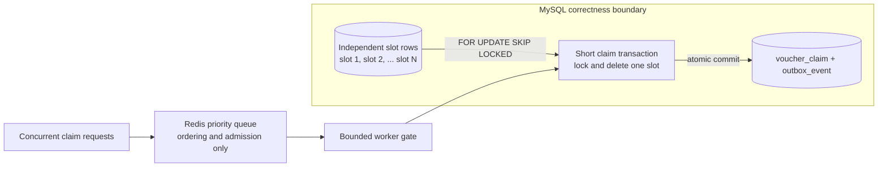

Redis neither stores nor decrements inventory. It only selects ordering and limits work entering the database. MySQL grants the voucher through one independent slot row, a local transaction, and unique constraints.

Each claimable voucher is one row keyed by `(campaign_id, slot_id)`:

```sql
SELECT campaign_id, slot_id
FROM voucher_claim_slot
WHERE campaign_id = :campaignId
ORDER BY slot_id
LIMIT 1
FOR UPDATE SKIP LOCKED;
```

How contention is reduced:

1. Worker A locks slot 1. Worker B skips it and locks slot 2 instead of waiting.
2. Transactions spread across many rows rather than serializing on one counter.
3. Each lock is held only while selecting/deleting a slot and inserting the claim/outbox.
4. All writes commit together; any failure restores the slot.
5. `UNIQUE (campaign_id, user_id)` remains the final protection against duplicate winners.

This trades additional storage and writes for parallel short transactions and strong business invariants.

#### Concurrent claim sequence

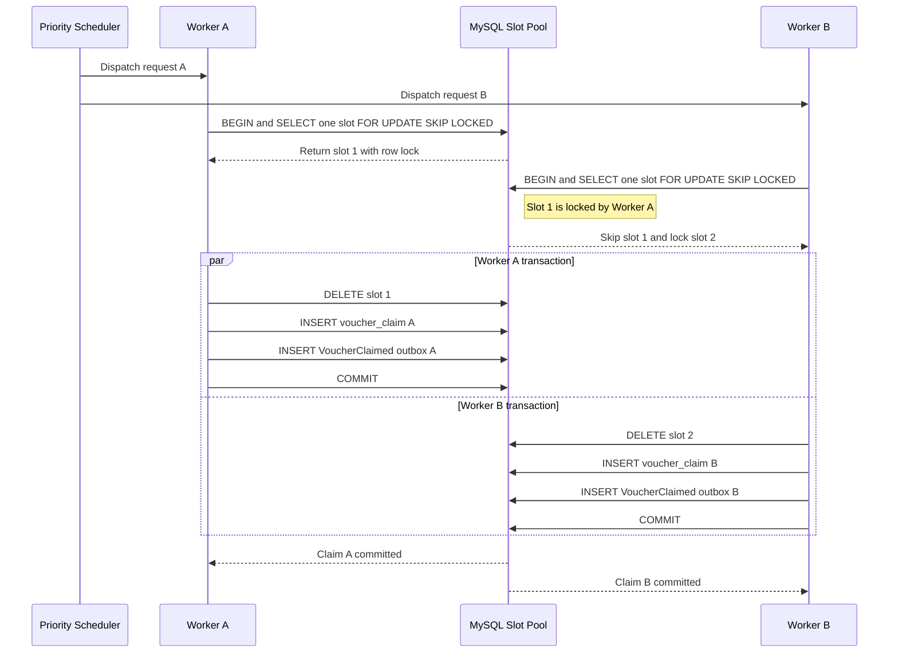

If every remaining slot is temporarily locked, the worker returns retryable `BUSY`. An empty `SKIP LOCKED` result alone never means `SOLD_OUT`. The request becomes `SOLD_OUT` only when no physical slot and no unallocated inventory remain.

### 11.3 Admission control before MySQL

```text
5,000 req/s ingress
        ↓
MySQL claim_request (durable admission)
        ↓ direct post-commit ZADD NX
Redis ZSET priority index
        ↓ bounded by available worker count
Claim transactions
        ↓
MySQL
```

`claim_request` absorbs durable intent and Redis orders it by score. Worker capacity determines inventory-write concurrency instead of the HTTP burst. A deterministic `requestId`, database uniqueness, and `ZADD NX` ensure repeated use of one idempotency key creates no additional operation.

The ZSET is only a derived scheduling index. It neither owns durable work nor grants vouchers.

### 11.4 Why Redis loss is not an endgame

- The API creates the asynchronous operation only after `claim_request` commits.
- If the process dies before `ZADD NX`, the durable row remains `PENDING` and discoverable.
- Repeated direct materialization collapses through the same `requestId` and `ZADD NX`.
- The Recovery Watcher rematerializes `PENDING`, `QUEUED`, and `RETRY_WAIT` rows.
- If a worker dies after pop, its `PROCESSING.leaseUntil` expires.
- If a worker dies after claim commit but before completing the request, the next attempt reads the durable claim and resolves `REPLAYED`.

Direct post-commit materialization is the low-latency path; the watcher is the anti-entropy safety net. Redis key-expiry events are not used as the scheduler.

### 11.5 Why Redis does not decrement inventory

A Redis `DECR` or Lua script is fast and atomic inside Redis, but the claim and outbox must still be persisted in MySQL. Redis and MySQL cannot commit atomically:

| Write order | Failure | Consequence |
|---|---|---|
| Redis first, MySQL second | MySQL fails or worker dies | Stock is lost without a durable claim |
| MySQL first, Redis second | Redis timeout or failover | Claim exists while Redis still exposes stock |
| Parallel writes | One side succeeds | Complex reconciliation and compensation |

Making Redis authoritative requires reservation leases, recovery, reconciliation, and idempotent compensation. MySQL is selected because one local transaction guarantees that a slot is consumed once, a user owns one claim, and the claim/outbox coexist.

Redis is used only where temporary data loss does not violate correctness: priority ordering, a 30-second positive replay cache, score snapshots, and short-lived request results.

### 11.6 When Redis inventory reservation could fit

Consider Redis reservation only when measured throughput exceeds database scaling, the business accepts `PENDING`, and complete reconciliation/compensation exists. A Lua script would create a TTL reservation; the claim would not be successful until the durable store commits. At the stated target, bounded workers and slot rows solve contention without this eventual-consistency workflow.

### 11.7 Distributed-lock policy

- No Redis lock around claims.
- No campaign-wide claim lock.
- MySQL locks only the selected slot row.
- A unique constraint enforces one claim per user.
- Redis atomic commands protect queue membership, not business invariants.
- The MySQL worker lease owns a durable task temporarily; it is not a distributed lock around the entire claim flow.

## 12. Slot Lifecycle

### Current implementation

- Campaign creation sets `unallocated_quantity = total_quantity`.
- Activation creates every slot in batches of 500.
- After all slots exist, `unallocated_quantity = 0` and status becomes `ACTIVE`.
- A successful claim deletes exactly one slot.
- No refill is required because activation materializes all current inventory.

### Large-inventory extension

Use bounded pre-allocation when inventory exceeds the current limit:

| Setting | Suggested value |
|---|---:|
| Initial slot batch | 5,000–20,000 |
| Low watermark | 20–30% of the batch |
| Refill size | 5,000–20,000 |

Refill transaction:

1. Lock campaign allocation metadata.
2. Reserve `min(refill_size, unallocated_quantity)`.
3. Decrement `unallocated_quantity`.
4. Insert the new slot-ID range.
5. Commit.

The refill lock is outside the claim path and is not a distributed claim lock.

## 13. Outbox

`outbox_event` protects the allocation-to-notification boundary. Allocation writes `voucher_claim + VoucherClaimed` in one transaction so a committed claim cannot miss its notification event. Admission durability comes from `claim_request` itself and does not need Kafka.

Claim event:

```json
{
  "event_type": "VoucherClaimed",
  "aggregate_type": "VoucherClaim",
  "aggregate_id": "<claim_id>",
  "payload": {
    "claim_id": "<claim_id>",
    "campaign_id": "<campaign_id>",
    "user_id": "<user_id>",
    "status": "ISSUED",
    "claimed_at": "<timestamp>"
  }
}
```

Publisher flow:

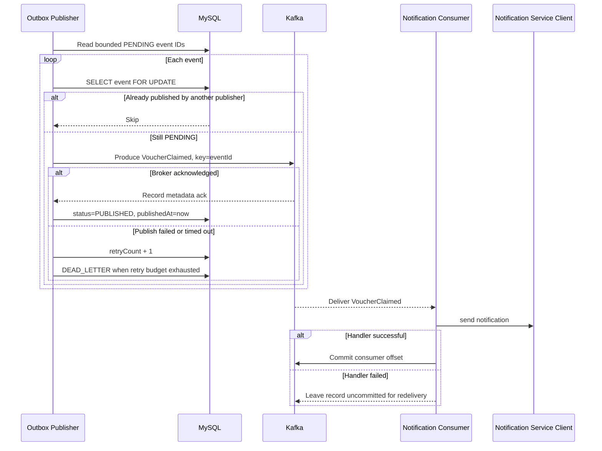

Implementation rules:

1. Poll a bounded batch through `(publish_status, created_at, event_id)`.
2. `lockById` uses a pessimistic row lock so two publishers cannot send one `PENDING` row concurrently.
3. Route `VoucherClaimed -> voucher.notifications`.
4. Use `eventId` as the Kafka key and mark `PUBLISHED` only after broker acknowledgement.
5. Increment `retry_count` on failure and move to `DEAD_LETTER` after the retry budget.
6. Outbox-to-Kafka is at-least-once; notification consumers are idempotent.
7. Commit the consumer offset only after successful handling.
8. `OutboxDeliveryServiceImpl` uses `TransactionTemplate` for an explicit database boundary.

Kafka does not replace the transactional outbox. The outbox commits business data and its event in one MySQL transaction; Kafka transports it after commit.

## 14. Sharding

### Baseline

Do not shard only because one campaign receives 5,000 requests/s. Redis absorbs ingress, while slot rows and worker admission reduce database contention.

### Sharding triggers

Shard after load tests show any of the following:

- Aggregate committed claim writes exceed one MySQL primary.
- Data or indexes no longer meet latency targets.
- Replication lag exceeds the SLO.
- P99 transaction latency remains high after admission tuning.

### Shard key

```text
shard = hash(campaign_id) % shard_count
```

Co-locate `voucher_campaign`, `voucher_claim_slot`, `claim_request`, `voucher_claim`, and `outbox_event`. A campaign stays on one shard, preserving a local transaction and avoiding distributed transactions.

## 15. Failure Handling

| Failure | Result |
|---|---|
| Redis replay cache unavailable | Skip the fast path; MySQL decides replay/admission |
| Score snapshot missing | Return `503 BUSY`; do not enqueue |
| API dies after admission commit but before Redis | Recovery materializes the durable `PENDING` request from MySQL |
| Direct Redis materialization fails | Durable request remains due; HTTP retry or Recovery Watcher repeats `ZADD NX` |
| Kafka unavailable | Claim processing continues; notification outbox remains `PENDING` |
| Redis restarts or loses a ZSET | Recovery runs `ZADD NX` from durable requests |
| Priority queue full | Durable request remains due and materialization retries |
| Worker dies before commit | Transaction rolls back and lease expiry retries |
| Worker dies after commit before request completion | Next attempt resolves the durable claim as replay |
| Redis result write fails | Claim remains durable and a retry reads MySQL |
| All slots temporarily locked | Return `BUSY` without marking sold out |
| No slot remains | Move the campaign to `SOLD_OUT` |
| Duplicate user race | Unique constraint selects one winner |
| Outbox insert fails | Entire claim transaction rolls back |
| Kafka publish fails or times out | Event stays `PENDING` and retry count increases |
| Outbox retry budget is exhausted | Event moves to `DEAD_LETTER` |
| Kafka ack succeeds but status commit fails | Event may publish again; consumer deduplicates by `eventId` |
| Notification handler fails | Offset is not committed and Kafka redelivers |
| Consumer dies after notification before offset commit | Notification Service deduplicates the redelivery |

## 16. Scaling Topology

### Stateless API

- Run many API instances behind a load balancer.
- Use the Redis `{campaignId}` hash tag to keep campaign keys in one cluster slot where atomicity is required.
- API instances hold no durable request state.

### Scheduler

The project uses Spring in-process scheduling, not Quartz. Each claim task is durable in `claim_request`; only trigger intervals are configuration.

| Job | Trigger | Responsibility |
|---|---|---|
| `PriorityScheduler` | `@Scheduled(fixedDelay = 10ms)` | Scan active campaigns, apply the priority window, run `ZPOPMAX`, and dispatch |
| `OutboxPublisher` | `@Scheduled(fixedDelay = 500ms)` | Poll bounded `PENDING` outbox IDs and deliver each event |
| `ClaimRequestRecoveryWatcher` | `@Scheduled(fixedDelay = 2s)` | Query due/expired requests and rematerialize them with `ZADD NX` |

`@EnableScheduling` enables triggers. Claim work runs on a separate bounded `claimWorkerExecutor`, not scheduler threads. Recovery uses indexed bounded scans rather than one job per request.

`fixedDelay` schedules the next run after the current run finishes, preventing self-overlap on one instance. `SCHEDULER_ENABLED=false` disables scheduled entry points.

The baseline uses one scheduler-enabled instance. Production multi-instance options are campaign ownership partitioning or leader election. Redis atomic pop and MySQL constraints preserve correctness if multiple schedulers run, but the in-memory priority-window timestamp would make ordering and scan frequency suboptimal. ShedLock and Quartz cluster coordination are not used.

### Database

- Bound worker concurrency to measured MySQL capacity.
- Add a read replica for history queries when needed.
- Keep claim, slot, request, and outbox writes on one primary/shard.

## 17. Observability

### Metrics

```text
claim_requests_total{campaign,result}
claim_replay_total{source=redis|mysql}
claim_queue_depth{campaign}
claim_queue_wait_ms
claim_transaction_ms
claim_slot_busy_total
claim_sold_out_total
claim_worker_active
claim_worker_rejected_total
redis_operation_ms{operation}
outbox_pending_total
outbox_oldest_pending_seconds
kafka_publish_latency_ms
kafka_consumer_lag
kafka_consumer_delivery_failures_total
```

### Structured logging

- `INFO`: campaign lifecycle, recovery batch size, and operational events.
- `DEBUG`: data flow by `requestId`, `campaignId`, `userId`, score, queue result, lease, attempt, transition, claim result, outbox event, and Kafka topic.
- Never log the raw `idempotencyKey`.
- Keep `VOUCHER_CLAIM_LOG_LEVEL=INFO` in production; 5,000 requests/s can otherwise amplify logs significantly.

### Alerts

- Queue depth continuously grows.
- Queue-wait P99 exceeds the SLO.
- Worker rejection remains above zero.
- MySQL transaction P99 rises.
- Redis error rate rises.
- Oldest pending outbox age exceeds its threshold.
- Kafka publish errors or consumer lag exceed thresholds.
- `BUSY` ratio increases while worker utilization stays low.

## 18. Load-Test Plan

### Scenario A — one hot campaign

- 5,000 requests/s.
- One campaign with varied score distributions.
- Assert no overselling and priority ordering within each window.

### Scenario B — idempotency spam

- One user, one key, 1,000 retries.
- Assert one ZSET member and one durable claim.

### Scenario C — same user, different keys

- 100 concurrent keys.
- Assert one claim and `ALREADY_CLAIMED` for the rest.

### Scenario D — many campaigns

- 5,000 requests/s/campaign across several campaigns.
- Assert independent queues and slot locks.

### Scenario E — dependency failures

- Restart Redis.
- Inject transient MySQL errors.
- Stop Kafka and restart consumers.
- Terminate workers before and after commit.
- Assert retrying one key never creates a second claim.

## 19. Correctness Invariants

1. `issued_claim_count <= total_quantity`.
2. At most one claim exists for `(campaign_id, user_id)`.
3. A slot is deleted only in the transaction that creates exactly one claim.
4. A committed claim has its outbox event in the same transaction.
5. Redis never caches success before MySQL commits.
6. Cache expiration never permits a second claim.
7. `SOLD_OUT` is returned only when no physical slot and no unallocated inventory remain.
8. The claim persists the same score snapshot used for enqueue.
9. Outbox status becomes `PUBLISHED` only after Kafka acknowledgement.
10. Two publishers never send one outbox row concurrently; sequential duplicate delivery remains possible.
11. Notification applies one business effect per `eventId` despite redelivery.
12. Every accepted operation is durable before Redis materialization.
13. Redis queues can be rebuilt from `claim_request`.
14. Only a worker holding an unexpired lease can execute the transaction.
15. One `(campaign_id, user_id, idempotency_key)` maps to one durable request.

## 20. Implementation Map

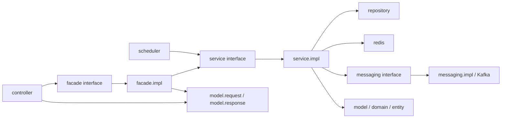
