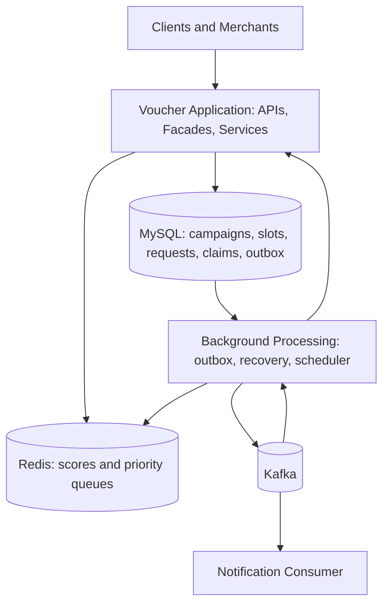
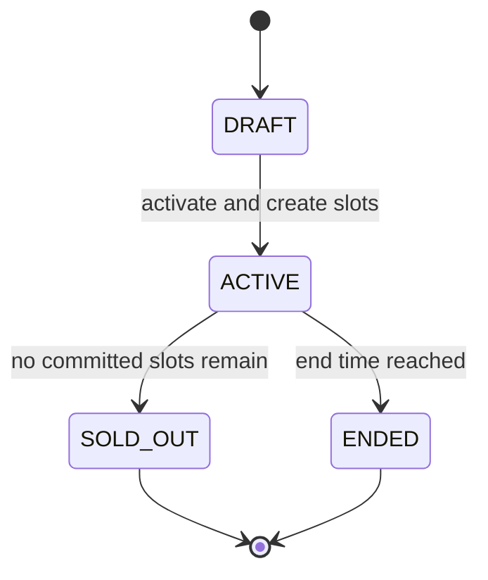
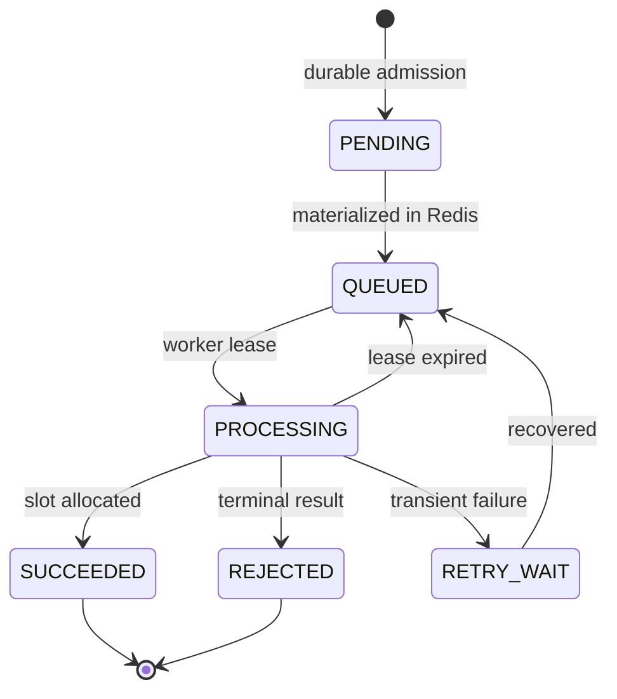
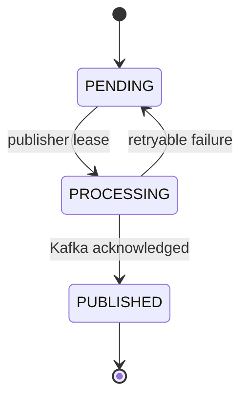
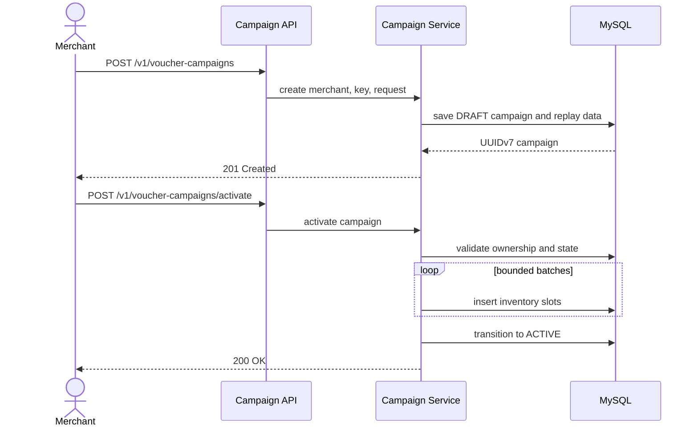
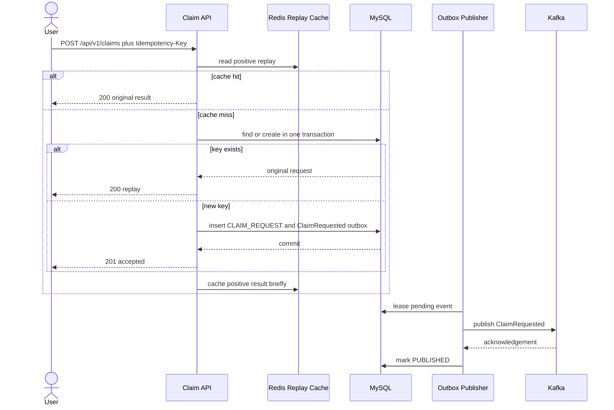
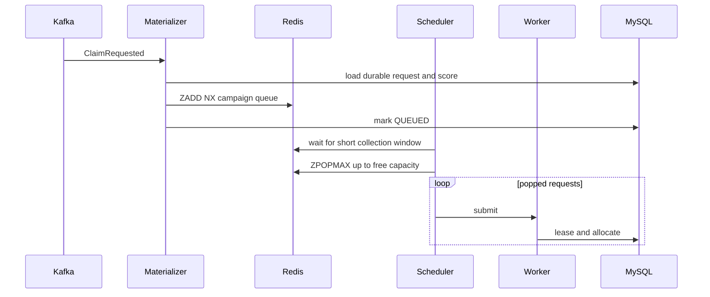
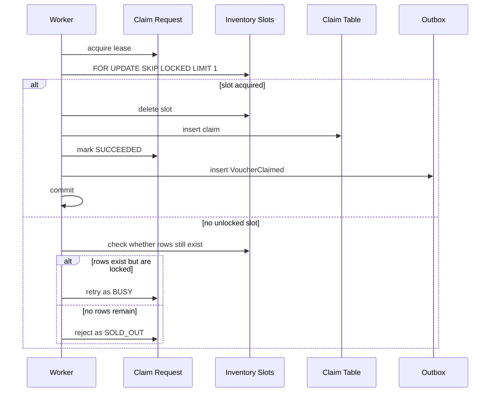

# Voucher Claim System Design

## 1. Scope

The system supports two main actions: a merchant creates and activates a finite voucher campaign, and a user submits an idempotent claim.

The critical workload is approximately 5,000 requests per second for one hot campaign. The design must avoid overselling, duplicate claims, and one-row contention. Accepted work must survive application, Redis, Kafka, and worker failures.

Higher-scored users should normally run first among requests visible in the same scheduling window. Strict global ordering is not required; small inversions caused by arrival timing and parallel commits are accepted.

## 2. Requirements

Functional requirements:

- Create a campaign in DRAFT state and activate it.
- Materialize finite inventory.
- Accept one logical request for each idempotency key.
- Allow at most one successful claim per user and campaign.
- Prefer higher trusted scores.
- Generate a unique voucher code.
- Publish successful claims for notification.
- Recover admitted work after infrastructure failures.

Non-functional requirements:

- Sustain 5,000 requests per second per campaign.
- Never allocate more vouchers than inventory.
- Keep admission short and durable.
- Scale consumers and workers horizontally.
- Make background work observable and retryable.

Voucher redemption, payment, strict global priority, multi-region writes, and initial database sharding are out of scope.

## 3. Core Decisions

| Concern | Decision |
|---|---|
| Source of truth | MySQL |
| Fast score ordering | Redis Sorted Set per campaign |
| Durable transport | Kafka |
| Reliable publication | Transactional outbox |
| Hot inventory | Materialized slot rows with FOR UPDATE SKIP LOCKED |
| Distributed claim lock | Not used |
| Transactions | TransactionTemplate |
| Persistence | Spring Data JPA / Hibernate |
| Campaign IDs | UUIDv7 |
| Delivery | At-least-once with idempotent processing |
| Priority | Best-effort within the visible window |

## 4. High-Level Architecture

This high-level view merges the Spring controllers, facades, services, schedulers, and workers into one application boundary. They may later be deployed independently without changing the correctness model.

| Component | Responsibility |
|---|---|
| Controllers | Validate transport data, log metadata, and call facades |
| Facades | Coordinate application use cases |
| Services | Enforce rules and state transitions |
| Repositories | Persist entities and execute native slot locking |
| Outbox publisher | Publish committed events to Kafka |
| Priority materializer | Add durable requests to Redis |
| Priority scheduler | Pop highest visible scores within worker capacity |
| Claim worker | Lease a request and allocate inventory |
| Recovery watcher | Restore lost queue state and expired leases |
| Notification consumer | Process VoucherClaimed events |

## 5. Data Model

    erDiagram
        VOUCHER_CAMPAIGN ||--o{ VOUCHER_CLAIM_SLOT : owns
        VOUCHER_CAMPAIGN ||--o{ CLAIM_REQUEST : receives
        VOUCHER_CAMPAIGN ||--o{ VOUCHER_CLAIM : allocates
        CLAIM_REQUEST ||--o| VOUCHER_CLAIM : produces

        VOUCHER_CAMPAIGN {
            char36 campaign_id PK
            varchar merchant_id
            varchar name
            bigint total_quantity
            varchar status
            timestamp starts_at
            timestamp ends_at
        }
        VOUCHER_CLAIM_SLOT {
            char36 campaign_id PK
            bigint slot_no PK
        }
        CLAIM_REQUEST {
            varchar request_id PK
            varchar idempotency_key UK
            char36 campaign_id
            varchar user_id
            bigint score
            varchar status
            timestamp next_attempt_at
            varchar lease_owner
            timestamp lease_until
            int attempt_count
        }
        VOUCHER_CLAIM {
            char36 claim_id PK
            char36 campaign_id
            varchar user_id
            varchar voucher_code UK
            timestamp claimed_at
        }
        OUTBOX_EVENT {
            char36 event_id PK
            varchar aggregate_type
            varchar aggregate_id
            varchar event_type
            text payload
            varchar status
            timestamp available_at
            timestamp lease_until
            int attempt_count
        }

Important constraints:

- UNIQUE(campaign_id, user_id) prevents one user from winning twice.
- UNIQUE(voucher_code) guarantees voucher-code uniqueness.
- UNIQUE(idempotency_key), or an operation-scoped equivalent, makes MySQL authoritative.
- The slot composite key makes every inventory unit independently lockable.
- Recovery and outbox scans use indexes beginning with status and the relevant time column.

## 6. State Machines

Campaign:

Claim request:

Outbox:

## 7. Campaign Flow

Activation is outside the hot claim path. Batching limits transaction size and memory use.

## 8. Durable Claim Admission

Redis absorbs immediate successful replays for about 20–30 seconds. A miss always continues to MySQL; Redis is not a negative cache or lock. Concurrent same-key requests race safely against a database unique constraint, and the loser reloads the durable request.

No request hash is required. Clients must permanently bind a key to one logical operation. UNIQUE(campaign_id, user_id) also protects against clients that retry with new keys.

## 9. Priority Scheduling

Each campaign uses a Redis Sorted Set:

    key: voucher:campaign:{campaignId}:priority
    member: durable claim request ID
    score: trusted score captured at admission

The materializer uses ZADD NX, so repeated Kafka delivery does not duplicate membership. The scheduler uses ZPOPMAX and never pops substantially more work than the executor can begin.

If A=800, B=200, C=100, and D=0 are present at pop time, Redis returns A, B, C, D. The collection window lets close arrivals compete; capacity-aware popping avoids a hidden FIFO queue behind Redis.

This is best-effort:

- A request not yet in Redis cannot compete with one already dispatched.
- Kafka partitions preserve arrival order, not score order.
- Parallel worker transactions can commit in another order.

Kafka is sufficient because brief, uncommon inversions are accepted. A topic or partition per score does not solve arrival timing, and RabbitMQ cannot preempt a message already delivered. Strict priority requires a durable closing window and ranked allocation batches.

## 10. High-Contention Allocation

Updating one remaining-quantity row would serialize every claim:

    UPDATE voucher_campaign
    SET remaining = remaining - 1
    WHERE campaign_id = ? AND remaining > 0

Instead, activation creates N independent slot rows for N vouchers. One worker transaction:

1. Acquires the durable request lease.
2. Rechecks terminal state and any existing claim.
3. Selects one slot with FOR UPDATE SKIP LOCKED LIMIT 1.
4. Deletes the slot.
5. Generates a voucher code.
6. Saves VOUCHER_CLAIM through JPA.
7. Marks the request SUCCEEDED.
8. Saves VoucherClaimed to the outbox.
9. Commits atomically.

SKIP LOCKED spreads workers across rows. An empty result does not prove sold out because other transactions may temporarily hold every remaining slot. The existence check distinguishes BUSY from SOLD_OUT.

A distributed Redis lock would add serialization, leases, and another dependency while database constraints remain necessary. Hot optimistic locking would create excessive retries, and pessimistic locking on the campaign row would serialize claims. The independent slot locks are the correctness boundary.

## 11. Outbox, Kafka, and Notifications

Directly writing MySQL and publishing Kafka is an unsafe dual write. The transactional outbox works as follows:

1. Business state and OUTBOX_EVENT commit together.
2. A scheduled publisher leases committed pending rows.
3. It publishes to Kafka.
4. It marks the row PUBLISHED after acknowledgement.
5. Failed and expired leases become retryable.

ClaimRequested moves durable admission toward scheduling. VoucherClaimed decouples notification from allocation, so notification failure never rolls back a claim.

Delivery is at-least-once. Event IDs, state checks, ZADD NX, and uniqueness make duplicates harmless. The outbox does not order users by score; ordering starts only in the Redis Sorted Set.

## 12. Durable Recovery

Redis is derived state. Every accepted job exists in CLAIM_REQUEST.

| Watcher | Durable table | Purpose |
|---|---|---|
| Outbox publisher | OUTBOX_EVENT | Move committed events to Kafka |
| Claim recovery watcher | CLAIM_REQUEST | Requeue stale PENDING, RETRY_WAIT, and expired PROCESSING work |

Spring schedules bounded, indexed scans. Database leases allow multiple instances without concurrently owning one row. Redis does not trigger or own the durable job lifecycle.

## 13. Failure Handling

| Failure | Recovery |
|---|---|
| API dies before commit | Client retries with the same key |
| API dies after commit before response | Replay loads the durable result |
| Publisher dies after send | Duplicate is handled idempotently |
| Kafka is unavailable | Outbox remains pending and retries |
| Redis is flushed | Recovery rebuilds queues from MySQL |
| Materializer sees duplicate | ZADD NX ignores duplicate membership |
| Scheduler dies after pop | Non-terminal request is requeued |
| Worker dies in transaction | Transaction rolls back; lease expires |
| All slots are locked | Retry as BUSY, not SOLD_OUT |
| Duplicate user claim | Unique constraint rejects it |
| Notification fails | Claim remains committed; consumer retries |

Use exponential backoff with jitter and a dead-letter topic for poison events.

## 14. Scaling and Sharding

Five thousand requests per second for one campaign does not automatically require database sharding. First scale stateless APIs, Kafka consumers, materializers, and workers; partition transport by campaignId; keep transactions short; limit pop batches to capacity; and index recovery scans.

Kafka partitioning groups campaign traffic but does not create score priority.

Shard only after measured primary saturation, unacceptable p99 transaction latency after tuning, excessive table size, or an isolation requirement. CampaignId is the natural future shard key because campaigns, slots, requests, and claims are campaign-local.

## 15. Observability and Tests

Log identifiers, state transitions, batch sizes, leases, retries, and terminal outcomes. Use DEBUG or sampling on high-volume controllers. Never log internal tokens, raw idempotency keys, or voucher secrets.

Track admission latency, replay rates, requests by state, Redis depth and age, priority inversions, worker utilization, BUSY/SOLD_OUT, database lock waits, outbox age, Kafka lag, recovery counts, and notification retries.

Tests cover UUIDv7 properties, campaign transitions, activation replay, idempotency, concurrent uniqueness, voucher-code uniqueness, Redis score ordering, duplicate materialization, BUSY versus SOLD_OUT, lease recovery, and outbox redelivery. Load tests should include 5,000 requests per second, duplicate storms, low inventory, Redis restart, Kafka outage, worker termination, and locked slots.

## 16. Correctness Invariants

1. Successful claims never exceed materialized slots.
2. A slot is consumed in the transaction that creates its claim.
3. A user has at most one claim per campaign.
4. A voucher code belongs to at most one claim.
5. One idempotency key maps to one durable request.
6. Every accepted non-terminal request is recoverable from MySQL.
7. Redis loss cannot lose accepted work.
8. Kafka duplication cannot duplicate allocation.

## 17. Implementation Architecture

    Controller
        → Facade
            → Service interface
                → service/impl
                    → JPA Repository / Redis / Kafka

Service interfaces document each operation. Implementations use TransactionTemplate and repository save methods. Native SQL is limited to the contention-sensitive slot query and other locking operations JPA cannot express cleanly.

## 18. Trade-off Summary

MySQL owns correctness, MySQL plus Kafka provide durability, and Redis provides fast priority scheduling. Materialized slots spend storage to remove one hot counter. Best-effort priority accepts small inversions for throughput and bounded latency.

If strict priority becomes mandatory, add a durable closing window and ranked allocation batch—not another topic, partition, queue product, or distributed lock.
