# Voucher Claim System — Solution

HTTP contract: [API-specs.md](API-specs.md).

## 1. Scope

### Functional requirements

- A merchant creates a voucher campaign.
- A merchant activates a campaign.
- A user can claim at most one voucher in a campaign.
- Requests with higher scores are processed first within the same priority window.
- Repeated claims for the same `(campaign_id, user_id)` return the same operation and result.
- The system supports a burst of 5,000 requests per second for one campaign.
- Every terminal claim outcome creates an outbox event. `VoucherClaimed` is emitted for success and `VoucherClaimRejected` for `SOLD_OUT`/`CAMPAIGN_NOT_ACTIVE`; the publisher sends both to Kafka for asynchronous consumption by the Notification Service.

### Non-functional requirements

- Keep the issued claim count within campaign inventory.
- Enforce one claim per `(campaign_id, user_id)`.
- Use MySQL as the source of truth for requests, inventory, claims, and events.
- Use Redis for priority scheduling and short-lived result caching.
- Admit requests directly at the expected traffic level of 5,000 requests/s/campaign.
- Allocate independent slot rows in short transactions, allowing workers to make progress in parallel.

### Out of scope

- Voucher redemption.
- Payment.
- Campaign search and catalog.
- JWT implementation.
- The external Notification Service.
- Cross-region active-active writes.

## 2. Traffic Model

| Item | Value |
|---|---:|
| Peak ingress | 5,000 claim requests/s/campaign |
| Internal priority collection window | 10–1,000 ms; default 100 ms |
| Maximum pending Redis queue | 10,000 requests/campaign |
| Claim admission response | MySQL commit + one best-effort Redis enqueue |
| Committed claim cache TTL | 30 seconds |
| Maximum inventory in the current implementation | 100,000 vouchers/campaign |

## 3. API Contract

### 3.1 Create campaign

```http
POST /api/v1/campaigns
X-Merchant-Id: <merchant_id>
Idempotency-Key: <key>
Content-Type: application/json
```

```json
{
  "name": "Summer campaign",
  "discountType": "PERCENTAGE",
  "discountValue": 15,
  "totalQuantity": 10000,
  "priorityOrder": "SCORE_DESC_THEN_REQUEST_MEMBER_DESC",
  "startAt": "2026-08-01T00:00:00Z",
  "endAt": "2026-09-01T00:00:00Z",
  "voucherExpiresAt": "2026-10-01T00:00:00Z"
}
```

Responses:

- `201 Created`: a new campaign.
- `200 OK` with `Idempotent-Replayed: true`: replay of the same creation key.
- `409 Conflict`: invalid campaign window.

### 3.2 Activate campaign

```http
POST /api/v1/campaigns/activate
X-Merchant-Id: <merchant_id>
Content-Type: application/json
```

```json
{
  "campaignId": "<campaign_uuid_v7>"
}
```

Responses:

- `202 Accepted`: activation job was stored; campaign status is `ACTIVATING`.
- `200 OK` with `Idempotent-Replayed: true`: activation is already running or finished.
- `404 Not Found`: the campaign is missing or belongs to another merchant.
- `409 Conflict`: the campaign state blocks activation.

### 3.3 Read campaign availability

```http
GET /api/v1/campaigns/status?campaignId=<campaign_uuid_v7>
```

```json
{
  "campaignId": "<campaign_uuid_v7>",
  "status": "ACTIVE",
  "claimable": true
}
```

The frontend polls every one or two seconds and disables Claim when `claimable` becomes false. A claim operation that reaches `REJECTED` with result `SOLD_OUT` also disables the action.

### 3.4 Claim voucher

```http
POST /api/v1/claims
Content-Type: application/json
```

```json
{
  "userId": "<user_id>",
  "campaignId": "<campaign_uuid_v7>"
}
```

| HTTP | Code | Meaning |
|---:|---|---|
| 202 | — | Durable request accepted as `PENDING`, `QUEUED`, or already processing |
| 200 | — | The same operation is terminal; response includes its result |
| 503 | `CLAIM_BUSY` | The durable MySQL admission could not be stored safely |

The POST response contains `requestId`. The client reads the final result through:

```http
GET /api/v1/claims/status?requestId=<request_id>
```

### 3.5 Read claim

```http
GET /api/v1/claims/me?campaignId=<campaign_uuid_v7>
X-User-Id: <user_id>
```

## 4. High-Level Architecture

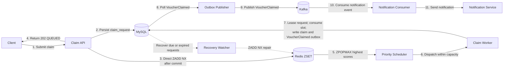

For a new request, the API first uses the short-lived availability cache to reject an obviously inactive or sold-out campaign. If the campaign is claimable, it commits `claim_request` before adding the user to the campaign Sorted Set. Redis orders pending users by the stored score, and the scheduler uses `ZPOPMAX` to dispatch the highest available scores into an elastic but bounded 8–32 worker pool with no JVM queue. Campaign activation and queue recovery use durable MySQL state; the worker rechecks campaign state authoritatively before consuming a slot.

MySQL remains the source of truth. If Redis loses a request, the Recovery Watcher can add it back from `claim_request`. Kafka is used after a terminal claim outcome to deliver success or rejection notifications.

## 5. Data Model

### Identifier format

`campaignId` uses UUIDv7 (RFC 9562).

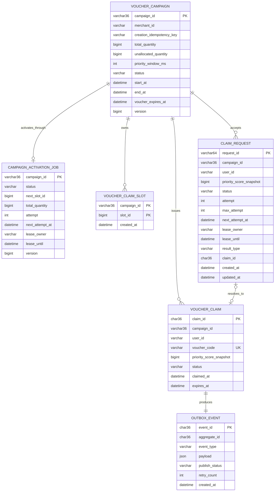

The diagram shows logical relationships only. The database does not create foreign-key constraints; services validate referenced IDs explicitly and each lookup uses the indexed ID columns.

### Required constraints

```sql
UNIQUE (merchant_id, creation_idempotency_key)
UNIQUE (campaign_id, user_id)
UNIQUE (voucher_code)
UNIQUE (campaign_id, user_id) -- claim_request
PRIMARY KEY (campaign_id, slot_id)
```

### Required indexes

```sql
INDEX idx_claim_user
    (campaign_id, user_id)

INDEX idx_campaign_status_time
    (status, start_at, end_at)

INDEX idx_outbox_unpublished
    (publish_status, created_at, event_id)

INDEX idx_claim_request_recovery
    (status, next_attempt_at, lease_until, created_at)

INDEX idx_activation_job_recovery
    (status, next_attempt_at, lease_until, created_at)
```

### State machines

Campaign lifecycle:

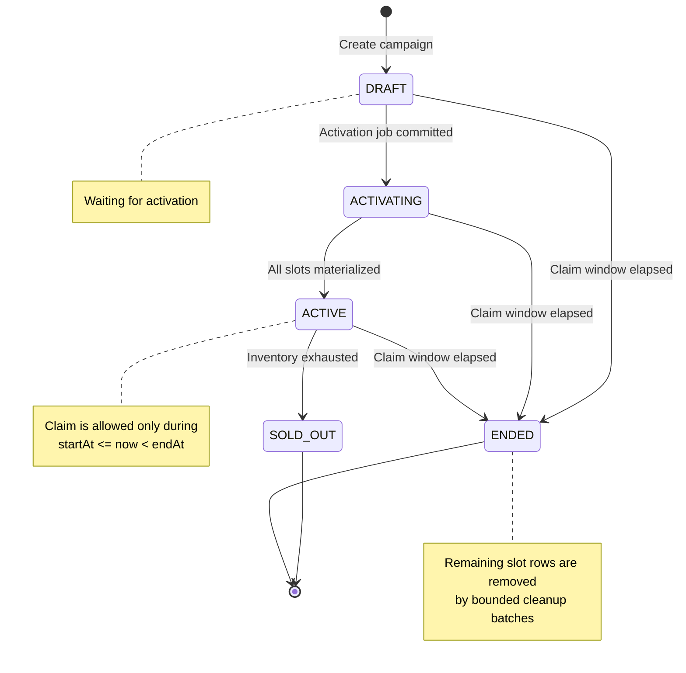

Rules:

- `DRAFT -> ACTIVATING` and job creation commit in one transaction.
- `ACTIVATING -> ACTIVE` commits with the final slot batch.
- `ACTIVE -> SOLD_OUT` occurs after both the physical slot count and unallocated inventory reach zero.
- `SOLD_OUT` and `ENDED` are terminal.
- The expiration worker moves an elapsed `DRAFT`, `ACTIVATING`, or `ACTIVE` campaign to `ENDED`.

Claim lifecycle in the current claim-only scope:

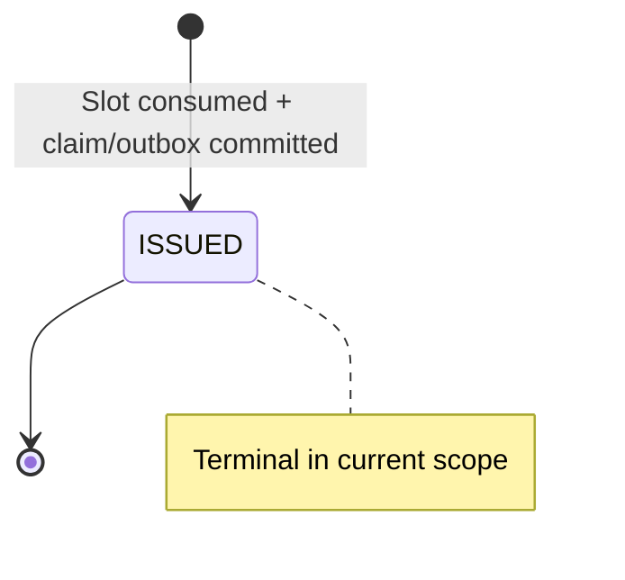

A claim exists after the MySQL transaction commits. When the transaction rolls back, the slot remains available and the claim and outbox event are rolled back with it.

Durable claim-request lifecycle:

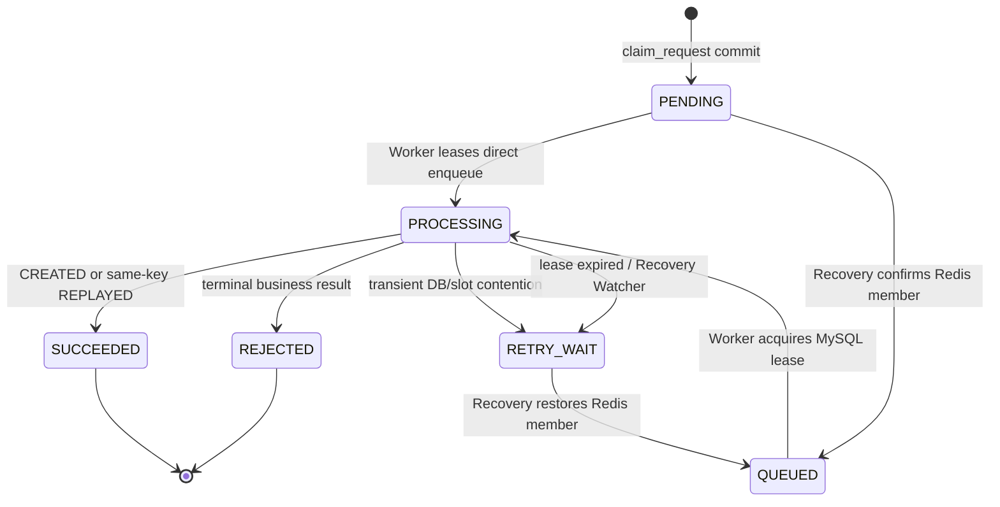

`PENDING`, `QUEUED`, and `RETRY_WAIT` are recoverable MySQL states. Direct admission returns after `ZADD NX`, so its durable row may remain `PENDING` until the worker leases it. When the watcher repairs a due request, it records `QUEUED` and moves `nextAttemptAt` forward. A `PROCESSING` request belongs to one worker until `leaseUntil`; completion and retry updates must match that worker's `leaseOwner`.

Outbox lifecycle:

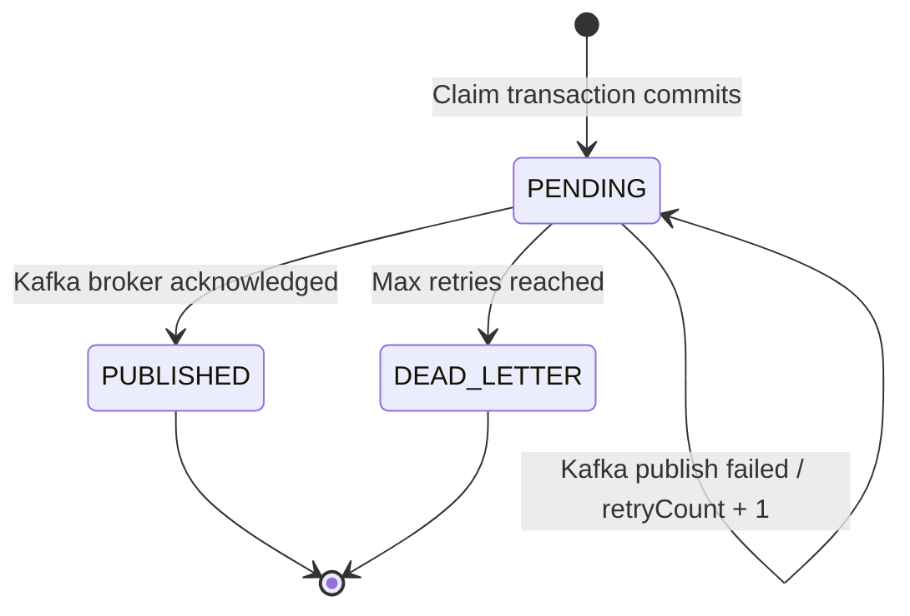

## 6. Redis Model

| Purpose | Key | Type | TTL |
|---|---|---|---:|
| Committed claim result | `claim:result:{campaignId}:{userId}` | JSON String | 30s |
| Campaign availability | `campaign:availability:{campaignId}` | JSON String | 1s |
| User score | `user:score:{userId}` | Integer String | 30m |
| Priority queue | `claim:priority:{campaignId}` | Sorted Set | 10m grace |
| Campaigns with pending work | `claim:priority:active-campaigns` | Set | none |

### Priority queue member

```text
member = userId
score  = priorityScoreSnapshot
```

### Enqueue operation

One Lua script atomically executes:

1. `ZSCORE` to detect the same pending logical request.
2. `ZCARD` to enforce the per-campaign queue limit.
3. `ZADD NX` to insert once.
4. `PEXPIRE` to refresh the queue grace TTL.

| Value | Result |
|---:|---|
| `1` | Added |
| `0` | Already pending |
| `-1` | Queue full |

## 7. Campaign Flows

### 7.1 Create

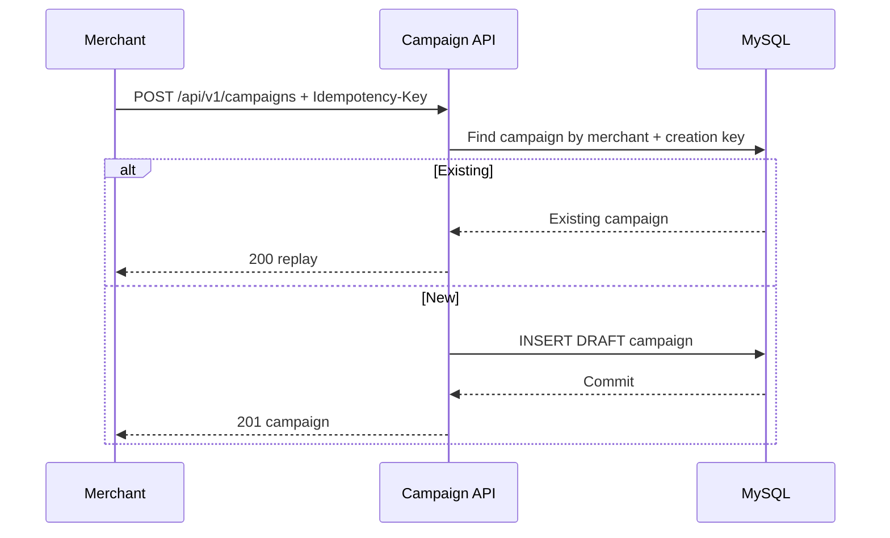

### 7.2 Activate

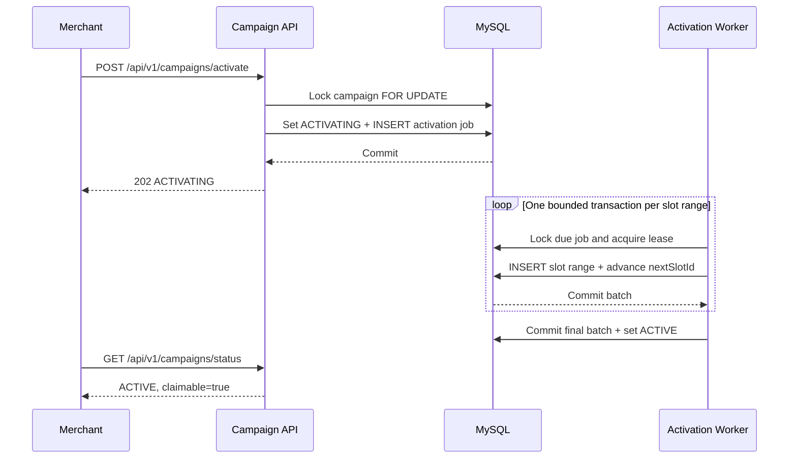

### 7.3 Read availability

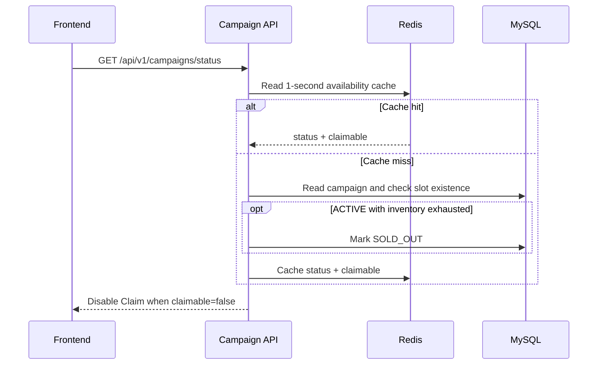

## 8. Claim Flow

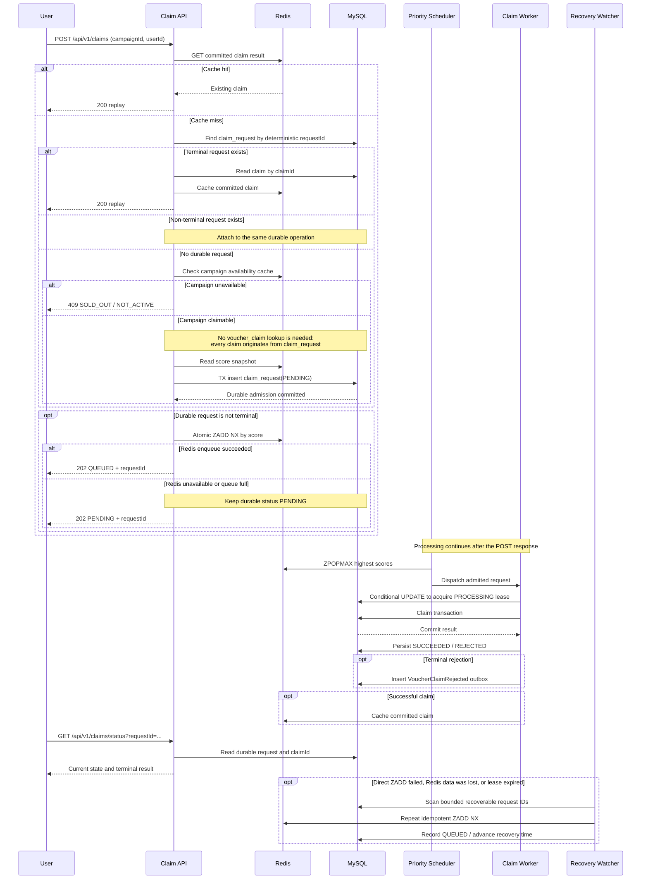

### Natural idempotency rules

- Scope: `(campaign_id, user_id)`.
- The deterministic `requestId` is the SHA-256 hash of that pair.
- Cache hit returns the committed claim immediately.
- Cache miss checks `claim_request`, not `voucher_claim`.
- If no durable request exists, the invariant guarantees that no claim created by this system exists.
- A new or existing non-terminal request is materialized with `ZADD NX`; retries therefore converge on one Sorted Set member.
- The POST call returns after durable admission and one best-effort Redis enqueue; it never waits for the priority window or worker.
- Redis failure leaves the operation `PENDING`; recovery performs `ZADD NX` later.
- `UNIQUE (campaign_id, user_id)` on both request and claim tables resolves concurrent admission and allocation races.
- Cache writes occur only after the MySQL claim transaction commits.
- HTTP retries and recovery may enqueue again, while `ZADD NX` and the worker lease converge on the same operation.

## 9. Priority Scheduling

### Ordering

```text
Primary:   priority_score_snapshot DESC
Tie-break: Redis member DESC
Scope:     one campaign + one priority window
```

### Scheduler policy

1. The API materializes each committed request directly into the ZSET; the Recovery Watcher repairs gaps from MySQL.
2. Scan `claim:priority:active-campaigns` every 10 ms.
3. Wait for `priority_window_ms` before the first dispatch.
4. Calculate free workers.
5. Set `batchSize = min(admissionBatchSize, availableWorkers)`.
6. Execute `ZPOPMAX batchSize`.
7. Submit workers; each worker acquires its MySQL lease with one conditional `UPDATE` and continues only when one row is affected.
8. Re-enqueue if the executor rejects submission.

Higher scores run first among requests visible when the scheduler selects a batch. Requests arriving in later batches and parallel transaction commits may appear in a different order.

## 10. Claim Transaction

Isolation level: `READ_COMMITTED`.

The project defines transaction boundaries with a shared `TransactionTemplate`. `ClaimTransactionServiceImpl.execute()` opens the boundary before invoking the claim logic, keeping slot deletion, claim insertion, and outbox insertion in one transaction.

```text
BEGIN
  1. SELECT claim WHERE campaign_id=? AND user_id=?
  2. Validate campaign status and time window
  3. SELECT one slot
       ORDER BY slot_id
       LIMIT 1
       FOR UPDATE SKIP LOCKED
  4. If the slot query is empty:
       - physical slot exists  -> BUSY
       - inventory exhausted   -> SOLD_OUT
  5. DELETE locked slot
  6. INSERT voucher_claim
  7. INSERT outbox_event
COMMIT
```

### Transactional boundary

The following commit or roll back together:

- Delete one claim slot.
- Insert one voucher claim.
- Insert one outbox event.

### Database race resolution

If two workers for one user reach MySQL:

1. Both can pass the initial read.
2. `UNIQUE (campaign_id, user_id)` selects one winner.
3. The losing transaction rolls back its slot deletion.
4. The worker reads the winner.
5. Every caller receives the same natural-idempotency claim result.

## 11. Contention Control

### 11.1 The shared-counter problem

The simplest design stores `remaining_quantity` in one campaign row:

```sql
UPDATE voucher_campaign
SET remaining_quantity = remaining_quantity - 1
WHERE campaign_id = :campaignId
  AND remaining_quantity > 0;
```

This keeps inventory correct, but every claim for one campaign competes for the same exclusive row lock. At 5,000 requests/s/campaign, transactions serialize at that hot row. Adding API instances or workers only increases pressure on it, along with lock waits, tail latency, timeouts, and retries.

### 11.2 Current solution: materialized claim slots

```text
One inventory unit = one voucher_claim_slot row
```

#### High-level contention design

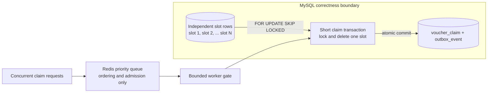

Redis orders requests and limits the work entering the database. MySQL owns inventory and grants each voucher through an independent slot row, a local transaction, and unique constraints.

Each claimable voucher is one row keyed by `(campaign_id, slot_id)`:

```sql
SELECT campaign_id, slot_id
FROM voucher_claim_slot
WHERE campaign_id = :campaignId
ORDER BY slot_id
LIMIT 1
FOR UPDATE SKIP LOCKED;
```

How contention is reduced:

1. Worker A locks slot 1. Worker B skips it and locks slot 2 instead of waiting.
2. Transactions spread across many rows rather than serializing on one counter.
3. Each lock is held only while selecting/deleting a slot and inserting the claim/outbox.
4. All writes commit together; any failure restores the slot.
5. `UNIQUE (campaign_id, user_id)` remains the final protection against duplicate winners.

This trades additional storage and writes for parallel short transactions and strong business invariants.

#### Concurrent claim sequence

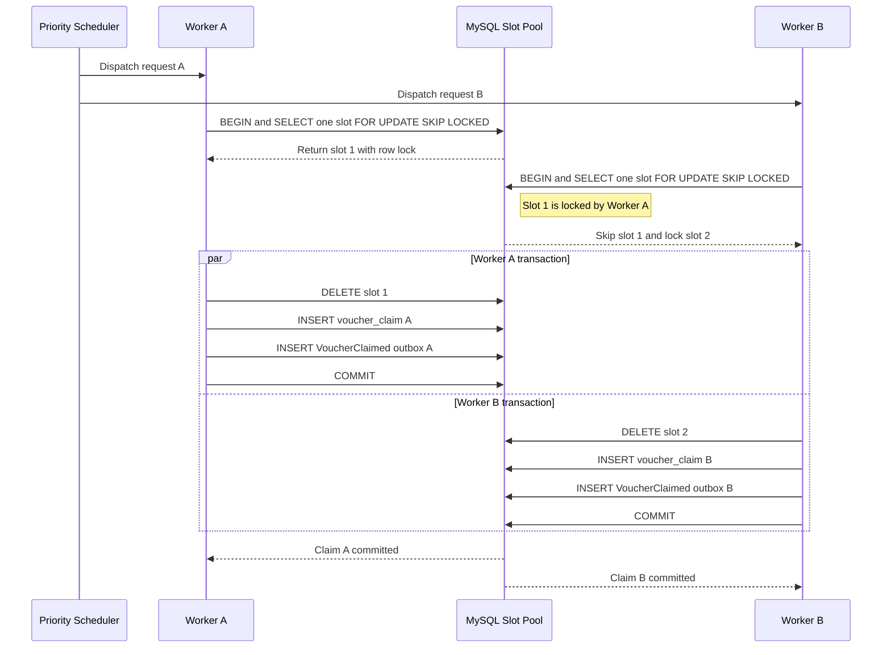

If every remaining slot is temporarily locked, the worker returns retryable `BUSY`. `SOLD_OUT` is returned after an authoritative check confirms that both physical slots and unallocated inventory are exhausted.

### 11.3 Admission control before MySQL

```text
5,000 req/s ingress
        ↓
MySQL claim_request (durable admission)
        ↓ direct post-commit ZADD NX
Redis ZSET priority index
        ↓ bounded by available worker count
Claim transactions
        ↓
MySQL
```

`claim_request` stores the request durably and Redis orders it by score. Worker capacity, rather than the HTTP burst, determines inventory-write concurrency. A deterministic `requestId`, database uniqueness, and `ZADD NX` make repeated requests for the same campaign and user converge on one operation.

The ZSET is a rebuildable scheduling index; `claim_request` owns the durable work and MySQL grants the voucher.

### 11.4 Redis recovery

- The API creates the asynchronous operation only after `claim_request` commits.
- If the process dies before `ZADD NX`, the durable row remains `PENDING` and discoverable.
- Repeated direct materialization collapses through the same `requestId` and `ZADD NX`.
- The Recovery Watcher rematerializes `PENDING`, `QUEUED`, and `RETRY_WAIT` rows.
- If a worker dies after pop, its `PROCESSING.leaseUntil` expires.
- If a worker dies after claim commit but before completing the request, the next attempt reads the durable claim and resolves `REPLAYED`.

Direct post-commit materialization is the low-latency path; the watcher is the recovery path. It reads durable request states from MySQL instead of relying on Redis key-expiry events.

### 11.5 Inventory stays in MySQL

A Redis `DECR` or Lua script is fast and atomic inside Redis, but the claim and outbox must still be persisted in MySQL. Redis and MySQL cannot commit atomically:

| Write order | Failure | Consequence |
|---|---|---|
| Redis first, MySQL second | MySQL fails or worker dies | Stock can be reserved while the claim is missing |
| MySQL first, Redis second | Redis timeout or failover | Claim exists while Redis still exposes stock |
| Parallel writes | One side succeeds | Complex reconciliation and compensation |

Making Redis authoritative requires reservation leases, recovery, reconciliation, and idempotent compensation. MySQL is selected because one local transaction guarantees that a slot is consumed once, a user owns one claim, and the claim/outbox coexist.

Redis holds rebuildable data: priority ordering, a 30-second positive claim cache, and score snapshots.

### 11.6 When Redis inventory reservation could fit

Redis reservation becomes useful when measured throughput exceeds database scaling and the product can expose a `PENDING` state backed by reconciliation and compensation. A Lua script can create a TTL reservation, with success returned after the durable store commits. At the stated target, bounded workers and slot rows provide enough concurrency with a simpler consistency model.

### 11.7 Distributed-lock policy

Claim ownership is split by scope:

- `ZADD NX` deduplicates Redis queue membership.
- One atomic conditional MySQL `UPDATE` assigns a durable request to one worker without a preceding `SELECT FOR UPDATE`.
- `FOR UPDATE SKIP LOCKED` assigns one inventory slot to a transaction.
- Unique constraints settle duplicate claim races.

These narrow ownership boundaries let independent claims run in parallel and remove the need for a campaign-wide lock.

## 12. Slot Lifecycle

### Current implementation

- Campaign creation sets `unallocated_quantity = total_quantity`.
- The activation API commits `ACTIVATING` and a `campaign_activation_job`, then returns `202`.
- `CampaignActivationWatcher` polls due jobs and creates slots in configurable batches (default 1,000).
- Each batch commits its slot range and `next_slot_id` cursor together.
- A worker owns a job through a renewable database lease. An expired lease can be recovered after a crash.
- The final batch sets `unallocated_quantity = 0` and status to `ACTIVE` in the same transaction.
- A successful claim deletes exactly one slot.
- Activation materializes the full inventory.

### Expired-slot cleanup

#### Problem

An expired campaign cannot issue more vouchers, but its unused `voucher_claim_slot` rows would otherwise remain in MySQL. Large expired campaigns would waste table, index, backup, and buffer-pool space.

#### Solution

`CampaignExpirationCleanupWatcher` scans MySQL for elapsed campaigns and for `ENDED` campaigns that still have slots. The worker first changes the campaign to `ENDED`, then deletes one bounded slot batch in the same transaction. The default batch size is 5,000 rows.

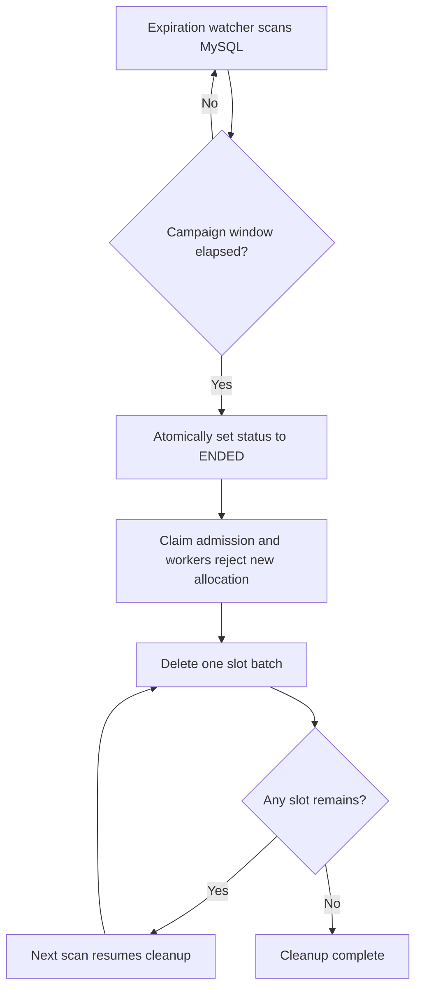

`ENDED` plus the existence of remaining slots is the durable cleanup cursor. No Redis key or separate job row is required: after a crash, the next scan finds the same campaign and continues. Each transaction deletes only one batch, which limits locks, undo logs, and replication pressure.

The activation worker cancels its job when the campaign is no longer `ACTIVATING`. If an activation batch races with expiration, an inserted slot is still discovered and removed by a later cleanup scan. Existing `voucher_claim`, `claim_request`, and `outbox_event` rows are retained for result lookup, notification, and audit.

### Enhancement: bounded slot materialization

#### Problem

The current activation worker creates one `voucher_claim_slot` row for every voucher before the campaign becomes `ACTIVE`. This is simple and works well for ordinary campaigns, but a campaign with millions of vouchers would cause:

- long activation time;
- large tables, indexes, binlogs, and backups;
- unnecessary rows when only part of the inventory is claimed;
- a longer wait before the campaign can accept claims.

#### Solution

Keep only a bounded working set of slot rows in MySQL. Activation creates the initial window and can then mark the campaign `ACTIVE`. A background refill worker adds another batch when the available slot count reaches the low watermark.

For example, a campaign with 10 million vouchers can start with 50,000 materialized slots. When only 10,000 remain, the worker creates the next 40,000. `unallocated_quantity` records inventory that has not yet been converted into slot rows.

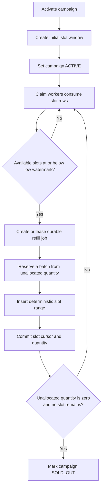

The refill transaction:

1. Locks the campaign allocation metadata or owns its refill job through a lease.
2. Reserves `min(refillSize, unallocatedQuantity)`.
3. Decrements `unallocated_quantity` and advances the slot cursor.
4. Inserts the deterministic slot-ID range.
5. Commits the metadata and slot rows together.

The claim path never performs a refill. If the materialized window is temporarily empty while `unallocated_quantity > 0`, the request remains retryable and triggers refill recovery; the campaign is not sold out. `SOLD_OUT` is valid only when both `unallocated_quantity = 0` and no materialized slot remains.

| Setting | Example value |
|---|---:|
| Initial slot window | 50,000 |
| Low watermark | 10,000 |
| Refill batch size | 40,000 |

This enhancement is not part of the current implementation. It becomes useful when full materialization makes activation time or slot-table size unacceptable.

## 13. Outbox

`outbox_event` protects the claim-to-notification boundary. A successful allocation writes `voucher_claim + VoucherClaimed` in one transaction; a terminal rejection writes `claim_request(REJECTED) + VoucherClaimRejected` in the completion transaction. `claim_request` provides admission durability; Kafka starts at the notification boundary.

Claim event:

```json
{
  "event_type": "VoucherClaimed",
  "aggregate_type": "VoucherClaim",
  "aggregate_id": "<claim_id>",
  "payload": {
    "claim_id": "<claim_id>",
    "campaign_id": "<campaign_id>",
    "user_id": "<user_id>",
    "status": "ISSUED",
    "claimed_at": "<timestamp>"
  }
}
```

Publisher flow:

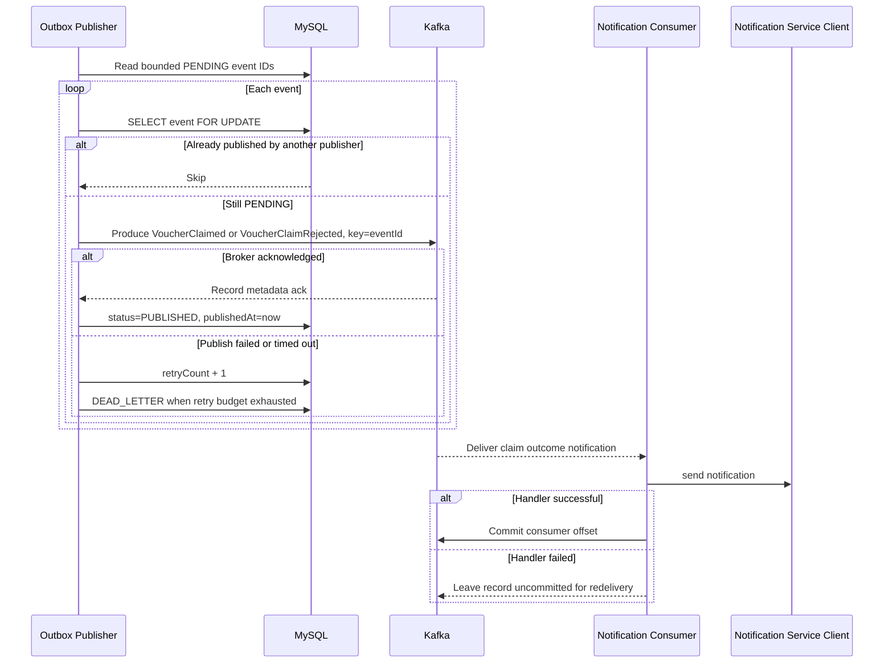

Implementation rules:

1. Poll a bounded batch through `(publish_status, created_at, event_id)`.
2. `lockById` uses a pessimistic row lock to assign each `PENDING` row to one publisher at a time.
3. Use `eventId` as the Kafka key. Delivery is at-least-once, so notification consumers deduplicate by that key.
4. `OutboxDeliveryServiceImpl` uses `TransactionTemplate` for its database boundary.

## 14. Sharding

### Baseline

Start with one database shard at 5,000 requests/s for a campaign. Redis scheduling, bounded worker admission, and independent slot rows address the first contention bottlenecks.

### Sharding triggers

Shard after load tests show any of the following:

- Aggregate committed claim writes exceed one MySQL primary.
- Data or indexes no longer meet latency targets.
- Replication lag exceeds the SLO.
- P99 transaction latency remains high after admission tuning.

### Shard key

```text
shard = hash(campaign_id) % shard_count
```

Co-locate `voucher_campaign`, `voucher_claim_slot`, `claim_request`, `voucher_claim`, and `outbox_event`. A campaign stays on one shard, preserving a local transaction and avoiding distributed transactions.

## 15. Failure Handling

| Failure | Result |
|---|---|
| API dies after activation commit | The activation job remains in MySQL and a worker continues it |
| Activation worker dies before batch commit | Slot inserts and cursor advance roll back together; the expired lease is retried |
| Activation worker dies after batch commit | The next pass continues at the stored `next_slot_id` |
| Campaign expires during activation | Campaign moves to `ENDED`; the activation job is canceled and materialized slots are cleaned in batches |
| Expiration cleanup stops mid-campaign | `ENDED` plus remaining slots makes the next scan resume cleanup |
| Redis replay cache unavailable | Skip the fast path; MySQL decides replay/admission |
| Redis availability cache unavailable | Read campaign status and slot existence from MySQL |
| Score snapshot missing | Return `503 BUSY`; no request is admitted without a trusted score |
| API dies after admission commit but before Redis | Recovery materializes the durable `PENDING` request from MySQL |
| Direct Redis materialization fails | Durable request remains due; HTTP retry or Recovery Watcher repeats `ZADD NX` |
| Kafka unavailable | Claim processing continues; notification outbox remains `PENDING` |
| Redis restarts or loses a ZSET | Recovery runs `ZADD NX` from durable requests |
| Priority queue full | Durable request remains due and materialization retries |
| Worker dies before commit | Transaction rolls back and lease expiry retries |
| Worker dies after commit before request completion | Next attempt resolves the durable claim as replay |
| Redis claim-cache write fails | Claim remains durable and status reads MySQL |
| All slots temporarily locked | Worker records retry state and recovery re-enqueues later |
| Inventory exhausted | Move the campaign to `SOLD_OUT` |
| Duplicate user race | Unique constraint selects one winner |
| Outbox insert fails | Entire claim transaction rolls back |
| Kafka publish fails or times out | Event stays `PENDING` and retry count increases |
| Outbox retry budget is exhausted | Event moves to `DEAD_LETTER` |
| Kafka ack succeeds but status commit fails | Event may publish again; consumer deduplicates by `eventId` |
| Notification handler fails | Kafka redelivers from the last committed offset |
| Consumer dies after notification before offset commit | Notification Service deduplicates the redelivery |

## 16. Scaling Topology

### Stateless API

- Run many API instances behind a load balancer.
- Use the Redis `{campaignId}` hash tag to keep campaign keys in one cluster slot where atomicity is required.
- Store all durable request state in MySQL.

### Scheduler

Spring scheduling runs the recurring triggers. Each claim task is durable in `claim_request`.

| Job | Trigger | Responsibility |
|---|---|---|
| `CampaignActivationWatcher` | `@Scheduled(fixedDelay = 100ms)` | Lease due activation jobs and materialize one bounded slot batch |
| `CampaignExpirationCleanupWatcher` | `@Scheduled(fixedDelay = 1s)` | End elapsed campaigns and delete one bounded slot batch per campaign |
| `PriorityScheduler` | `@Scheduled(fixedDelay = 10ms)` | Scan active campaigns, apply the priority window, run `ZPOPMAX`, and dispatch |
| `OutboxPublisher` | `@Scheduled(fixedDelay = 500ms)` | Poll bounded `PENDING` outbox IDs and deliver each event |
| `ClaimRequestRecoveryWatcher` | `@Scheduled(fixedDelay = 2s)` | Query due/expired requests and rematerialize them with `ZADD NX` |

A bounded `claimWorkerExecutor` runs claim work, while recovery uses indexed batch scans.

The baseline uses one scheduler-enabled instance. A production deployment can add campaign ownership partitioning or leader election. Redis atomic pop and MySQL constraints preserve correctness when multiple schedulers run, although the in-memory priority-window timestamp can make ordering and scan frequency less efficient.

### Database

- Bound worker concurrency to measured MySQL capacity.
- Add a read replica for history queries when needed.
- Keep claim, slot, request, and outbox writes on one primary/shard.

## 17. Implementation Map

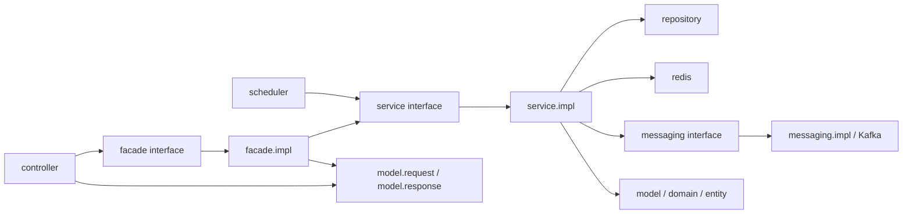
